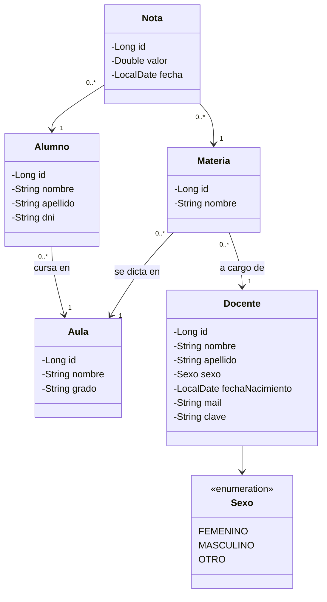

# Ejercicio 6i — Sistema Escolar (MVC con IA)

Software para colegios donde se registran los alumnos con su grado y aula, junto a sus profesores, y las notas por materia. Basado en las historias de usuario del **Ejercicio 6h grupal**.

Incluye Spring MVC, Thymeleaf, JPA con MySQL, DTOs entre capas, **seguridad** con Spring Security, **auditoría de entidades** con Hibernate Envers y envío de **correo de bienvenida** al registrarse un docente.

Plantilla HTML/CSS Bootstrap 5: **Spark Admin** de ThemeWagon (https://themewagon.com/themes/spark/), licencia MIT.

## Ejecutar

```powershell
cd 'TPN1/Ejercicio 6/Ejercicio 6i'
mvn -s maven-settings.xml spring-boot:run
```

Abrir `http://localhost:8080`. Iniciar **MySQL** desde XAMPP; la base `ejercicio6` se crea sola.

Usuario de prueba: `docente@colegio.com` / `docente123`. Desde `/registro` se pueden registrar nuevos docentes.

### Correo de bienvenida

Se envía por Gmail al registrarse un docente. Configurar las variables de entorno antes de ejecutar (la clave debe ser una *contraseña de aplicación* de Google):

```powershell
$env:MAIL_USUARIO = "cuenta@gmail.com"
$env:MAIL_CLAVE = "clave-de-aplicacion"
```

Si no se configuran, el registro funciona igual y el error de envío queda en el log.

## Diagrama de clases



El docente ingresa con su correo personal (usuario) y contraseña, y puede cambiarla desde **Cambiar contraseña**.

## Funcionalidades

| Historia de usuario (6h) | Ruta |
|---|---|
| Registrar alumnos con su grado | `/alumnos` |
| Registrar aulas | `/aulas` |
| Registrar profesores | `/registro`, `/docentes` |
| Registrar materias y asociar profesores con aulas | `/materias` |
| Registrar notas | `/notas` |
| Consultar notas de un alumno | `/notas?alumnoId=` |

## Seguridad y auditoría

- `SecurityConfig` protege todas las rutas salvo login, registro y recursos estáticos. Las contraseñas se guardan con BCrypt.
- Todas las entidades tienen `@Audited`; Envers crea la tabla `REVINFO` y una tabla `_AUD` por entidad. La clave del docente no se audita.
- Cada nota tiene un **Historial** con sus revisiones (alta, modificación y baja).

## Estructura

```
src/main/java/ar/edu/is2/ejercicio6
├── config       SecurityConfig y datos iniciales
├── controller   Controladores MVC
├── dto          Objetos de transferencia entre capas
├── model        Entidades JPA auditadas
├── repository   JpaRepository + RevisionRepository
└── service      Lógica de negocio, correo y conversión a DTO
```
