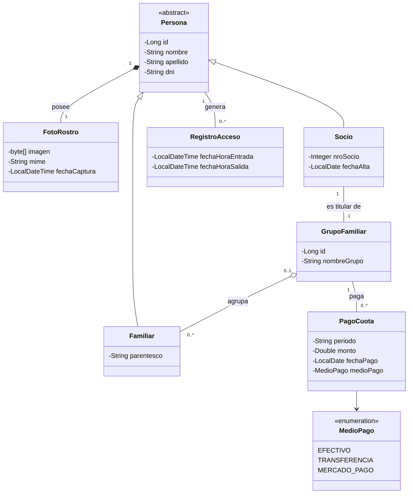

# Ejercicio 7g — Club Deportivo (MVC con IA)

Sistema para un club deportivo donde se registra el socio y su grupo familiar, cada persona con una imagen de su rostro, el horario de entrada y salida del club y el **pago de la cuota de cada familia** (Efectivo, Transferencia o Mercado Pago).

Basado en el diagrama de clases y las historias de usuario del **Ejercicio 7f grupal** (US-01, US-02, US-05, US-06 y US-07). Incluye Spring MVC, Thymeleaf, JPA con MySQL, DTOs entre capas, **seguridad** con Spring Security, **auditoría** con Hibernate Envers y **pruebas unitarias, de carga y de estrés**.

Plantilla HTML/CSS Bootstrap 5: **Spark Admin** de ThemeWagon (https://themewagon.com/themes/spark/), licencia MIT.

## Ejecutar

```powershell
cd 'TPN1/Ejercicio 7/Ejercicio 7g'
mvn -s maven-settings.xml spring-boot:run
```

Abrir `http://localhost:8080`. Iniciar **MySQL** desde XAMPP; la base `ejercicio7` se crea sola.

Usuario: `recepcion@club.com` / `club123`.

## Diagrama de clases (rediseñado)



Respecto del diagrama grupal se agregan **PagoCuota** y **MedioPago** para registrar el pago mensual de cada familia. Profesor, Credencial, planes, instalaciones y actividades quedan fuera del alcance.

## Funcionalidades

| Historia de usuario | Ruta |
|---|---|
| US-01 Alta de socio titular con foto de rostro (DNI único, JPG/PNG hasta 5 MB) | `/socios` |
| US-02 Grupo familiar: agregar y quitar familiares con parentesco y foto | `/socios/{id}` |
| US-05 Registro de entrada (no se admite un segundo ingreso sin salida) | `/accesos` |
| US-06 Registro de salida y permanencia | `/accesos` |
| US-07 Personas dentro del club | `/accesos` |
| Pago de la cuota por familia (un pago por período) | `/pagos` |

Al quitar un familiar del grupo, la persona sigue existiendo y conserva su historial de accesos (agregación).

## Seguridad y auditoría

- `SecurityConfig` protege todas las rutas salvo el login y los recursos estáticos. Las contraseñas se guardan con BCrypt y los formularios usan token CSRF.
- Todas las entidades tienen `@Audited`; Envers crea la tabla `REVINFO` y una tabla `_AUD` por entidad. No se auditan la imagen del rostro ni la clave.

## Pruebas

### Unitarias e integración (JUnit 5 + Mockito)

```powershell
mvn -s maven-settings.xml test
```

| Clase | Tipo | Qué verifica |
|---|---|---|
| `SocioServiceTest` | Unitaria | Alta asigna número de socio y crea el grupo familiar; DNI duplicado; foto obligatoria; solo JPG/PNG; campos vacíos |
| `AccesoServiceTest` | Unitaria | Registra entrada; no permite doble ingreso; no permite salida sin ingreso; cierra el ingreso abierto |
| `PagoServiceTest` | Unitaria | Registra el pago con cada medio de pago; monto mayor a cero; formato de período; un pago por período |
| `AuditoriaTest` | Integración (H2) | Envers guarda las revisiones INSERT y UPDATE de un pago |
| `SeguridadTest` | Integración (MockMvc) | Sin sesión redirige al login; login correcto e incorrecto; acceso autenticado |

Resultado: **20 pruebas, 0 fallas**.

### Carga y estrés (JMeter)

Los planes están en `pruebas/`. Cada usuario virtual inicia sesión una vez (obteniendo el token CSRF) y luego recorre en bucle `/socios`, `/accesos` y `/pagos`, validando que la respuesta sea 200.

| Plan | Usuarios | Rampa | Duración | Pausa | Objetivo |
|---|---|---|---|---|---|
| `carga.jmx` | 50 | 30 s | 2 min | 500 ms | Comportamiento con la cantidad de usuarios esperada |
| `estres.jmx` | 400 | 2 min | 5 min | 100 ms | Llevar el sistema por encima de lo esperado para encontrar su límite |

Con la aplicación en ejecución:

```powershell
jmeter -n -t pruebas/carga.jmx -l carga.jtl -e -o reporte-carga
jmeter -n -t pruebas/estres.jmx -l estres.jtl -e -o reporte-estres
```

Los valores se pueden cambiar con `-Jusuarios=`, `-Jrampa=`, `-Jduracion=`, `-Jpuerto=` y `-Jhost=`.

Ejecución de verificación en una PC local (H2 en memoria):

| Prueba | Usuarios / duración | Pedidos | Rendimiento | Tiempo medio | Errores |
|---|---|---|---|---|---|
| Carga | 10 / 30 s | 524 | 17,5 ped/s | 16 ms | 0 % |
| Estrés | 80 / 40 s | 26.018 | 649 ped/s | 6 ms | 0 % |

## Estructura

```
src/main/java/ar/edu/is2/ejercicio7
├── config       SecurityConfig y datos iniciales
├── controller   Controladores MVC
├── dto          Objetos de transferencia entre capas
├── model        Entidades JPA auditadas
├── repository   JpaRepository + RevisionRepository
└── service      Lógica de negocio y conversión a DTO
src/test/java    Pruebas unitarias y de integración
pruebas/         Planes de carga y estrés de JMeter
```
